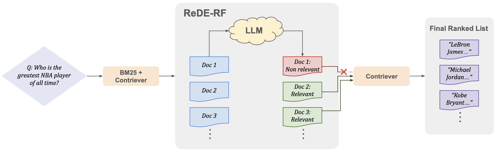

# ReDE-RF: Zero-Shot Dense Retrieval with Embeddings from Relevance Feedback

This is the code for the paper: [Zero-Shot Dense Retrieval with Embeddings from Relevance Feedback](https://arxiv.org/abs/2410.21242)

## Overview



Building effective dense retrieval systems remains difficult when relevance supervision is not available. Recent work has looked to overcome this challenge by using a Large Language Model (LLM) to generate hypothetical documents that can be used to find the closest real document. However, this approach relies solely on the LLM to have domain-specific knowledge relevant to the query, which may not be practical. Furthermore, generating hypothetical documents can be inefficient as it requires the LLM to generate a large number of tokens for each query. To address these challenges, we introduce Real Document Embeddings from Relevance Feedback (ReDE-RF). Inspired by relevance feedback, ReDE-RF proposes to re-frame hypothetical document generation as a relevance estimation task, using an LLM to select which documents should be used for nearest neighbor search. Through this re-framing, the LLM no longer needs domain-specific knowledge but only needs to judge what is relevant. Additionally, relevance estimation only requires the LLM to output a single token, thereby improving search latency. Our experiments show that ReDE-RF consistently surpasses state-of-the-art zero-shot dense retrieval methods across a wide range of low-resource retrieval datasets while also making significant improvements in latency per-query.

## Setup

We use the following packages and versions:

```
pyserini==0.43.0
pandas==2.2.3
transformers==4.48.2
torch==2.5.1
tqdm==4.67.1
faiss-cpu==1.7.4
nltk==3.9.1
accelerate==1.2.1
bitsandbytes==0.45.0
```

### Download MS-MARCO Contriever index

For TREC DL19 and DL20, we download the Contriever pre-built index following the steps in the HyDE [repo](https://github.com/texttron/hyde/tree/main):

```
wget  https://www.dropbox.com/s/dytqaqngaupp884/contriever_msmarco_index.tar.gz
tar -xvf contriever_msmarco_index.tar.gz
```
Lastly, update the paths of dl19 and dl20 in```THE_DENSE_INDEX``` in index_paths.py to point to the directory you stored the Contriever MS-MARCO index in.

## Run ReDE-RF

Once the above is finished, you can run ReDE-RF!

To run ReDE-RF, run the following command:

```
python rede_rf.py \
    --instruction_model_path $MODEL \
    --query_encoder_path facebook/contriever \
    --corpus_name $CORPUS_NAME \
    --prompt_version 'v1' \
    --init_retrieval_method $INIT_RETRIEVAL_METHOD \
    --k_init 20 \
    --k 20 \
    --default $DEFAULT \
    --output_filename $OUTPUT_FILENAME 
```
where:

```--instruction_model_path```: the path to your LLM \
```--query_encoder_path```: Path to the Contriever encoder (i.e., ```facebook/contriever```) \
```--prompt_version```: Which prompt to use for relevance feedback ('v1' is default prompt shown in Figure 2 of paper; see prompts.py) \
```--corpus_name```: Corpus to evaluate on (e.g., 'dl19', 'dl20', 'news', 'covid', 'fiqa', etc.) \
```--init_retrieval_method```: Choices: 'sparse', 'dense', or 'hybrid' \
```--k_init```: Number of documents for the LLM-RF to judge. \
```--k```: Number of passages to retrieve for final ranking \
```--default```: The default if ReDE-RF finds no relevant documents. Choices: 'None', 'query_encoder', 'hyde', or 'hyde_prf' \
```--rerank_rede```: Rerank the ReDE-RF ranking using LLM-RF \
```--output_filename```: Where to save ReDE-RF ranking 

## Running Baselines

To run our baselines (HyDE, HyDE-PRF, CSQE), the code is very similar:

HyDE: 

```
python hyde.py \
    --instruction_model_path $MODEL \
    --query_encoder_path facebook/contriever \
    --corpus_name $CORPUS_NAME \
    --k 20 \
    --num_hypothetical_documents 8 \
    --output_filename $OUTPUT_FILENAME \
```

HyDE-PRF:

```
python hyde_prf.py \
    --instruction_model_path $MODEL \
    --query_encoder_path facebook/contriever \
    --corpus_name $CORPUS_NAME \
    --init_retrieval_method $INIT_RETRIEVAL_METHOD \
    --k_init 20 \
    --k 20 \
    --num_hypothetical_documents 8 \
    --output_filename $OUTPUT_FILENAME \
```

CSQE:
```
python csqe.py \
    --instruction_model_path $MODEL \
    --query_encoder_path facebook/contriever \
    --prompt_version 'v1' \
    --corpus_name $CORPUS_NAME \
    --init_retrieval_method $INIT_RETRIEVAL_METHOD \
    --k_init 20 \
    --k 20 \
    --output_filename $OUTPUT_FILENAME \
```

## Citation

Please cite our paper if it is helpful to your work!
```
@article{jedidi2024zero,
  title={Zero-Shot Dense Retrieval with Embeddings from Relevance Feedback},
  author={Jedidi, Nour and Chuang, Yung-Sung and Shing, Leslie and Glass, James},
  journal={arXiv preprint arXiv:2410.21242},
  year={2024}
}
```

## Awknowledgements

Research was sponsored by the Department of the Air Force Artificial Intelligence Accelerator and was accomplished under Cooperative Agreement Number FA8750-19-2-1000. The views and conclusions contained in this document are those of the authors and should not be interpreted as representing the official policies, either expressed or implied, of the Department of the Air Force or the U.S. Government. The U.S. Government is authorized to reproduce and distribute reprints for Government purposes notwithstanding any copyright notation herein.

The software/firmware is provided to you on an As-Is basis.
